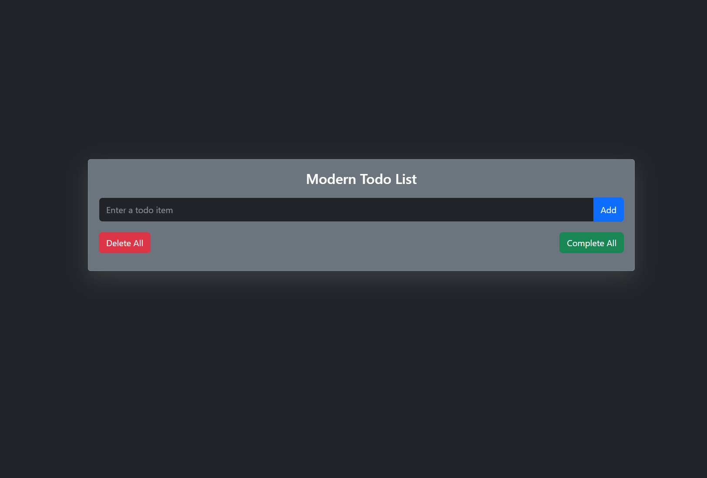

# Modern Responsive Todo List

A sleek, responsive todo list application built with HTML, CSS, and JavaScript, utilizing Bootstrap for a modern dark theme interface.



## Features

- Clean and modern dark theme interface
- Responsive design that works on mobile and desktop
- Add, delete, and mark tasks as complete
- Delete all tasks at once
- Mark all tasks as complete
- Animated task items for better user interaction

## Live Demo

[View Live Demo](https://aytekinkaplan.github.io/Todo-List/)

## Getting Started

These instructions will help you set up a copy of the project on your local machine for development and testing purposes.

### Prerequisites

- A modern web browser
- Basic knowledge of HTML, CSS, and JavaScript

### Installation

1. Clone the repository:
   ```
   git clone https://github.com/aytekinkaplan/Todo-List.git
   ```

2. Navigate to the project directory:
   ```
   cd Todo-List
   ```

3. Open the `index.html` file in your web browser.

## Usage

1. Enter a task in the input field and click "Add" or press Enter to add it to your todo list.
2. Click on a task to mark it as complete. Click again to undo.
3. Use the "Delete All" button to remove all tasks from the list.
4. Use the "Complete All" button to mark all tasks as completed.

## Built With

- HTML5
- CSS3
- JavaScript
- [Bootstrap 5](https://getbootstrap.com/) - For responsive design and styling
- [Animate.css](https://animate.style/) - For animations

## Contributing

We welcome contributions to improve the todo list app. Please follow these steps to contribute:

1. Fork the repository
2. Create your feature branch (`git checkout -b feature/AmazingFeature`)
3. Commit your changes (`git commit -m 'Add some AmazingFeature'`)
4. Push to the branch (`git push origin feature/AmazingFeature`)
5. Open a Pull Request

## License

This project is licensed under the MIT License - see the [LICENSE.md](LICENSE.md) file for details.

## Acknowledgments

- Hat tip to anyone whose code was used
- Inspiration
- etc
